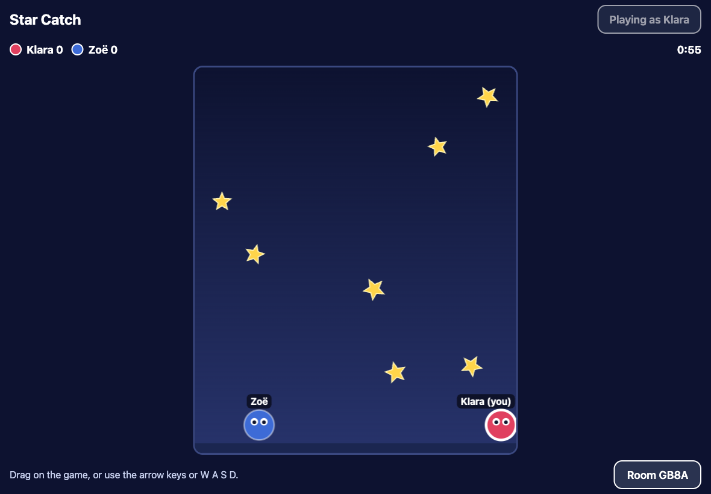

# Make a game together

This is a starter for making your own browser game with an AI helper, and
playing it with family and friends. A grown-up and a child do it together:
the child has the ideas and plays, the grown-up handles the accounts, and
the AI writes the code.

You will end up with a game at your own web address, like
`https://your-name.github.io/dragon-dash/`, that anyone you send it to can
play, together, from different homes.

**Time:** about an hour the first time, then as long as you like.

## What you need

- **A computer, tablet or phone** with a web browser. A computer is easiest
  the first time.
- **A GitHub account** (free) at [github.com](https://github.com). GitHub
  keeps your game's code and puts it on the web. You must be 13 or older to
  have one, so for younger children it is the grown-up's account.
- **A Claude account with Claude Code**: the Pro plan or higher at
  [claude.ai](https://claude.ai). The account holder must be 18 or older, so
  it is the grown-up's. This guide uses Claude Code.
- **No Claude plan?** Codex in ChatGPT (included in the free plan for now;
  13+, with a parent's permission under 18) and GitHub Copilot Free (13+)
  can also build from this starter: they read the same rules
  (`AGENTS.md`). The steps differ a little from the ones below.

## 1. Make your own copy (5 minutes)

1. Open **[the starter on GitHub](https://github.com/Rio517/arcade-game-starter)**.
2. Click **Use this template**, then **Create a new repository**.
3. Give it a name for your game, in small letters with dashes:
   `dragon-dash`. Choose **Public**. Click **Create repository**.

## 2. Put it on the web (5 minutes)

1. In your new repository, open **Settings**, then **Pages**.
2. Under **Build and deployment**, set **Source** to **GitHub Actions**.
3. Open the **Actions** tab, choose **Deploy to GitHub Pages**, and click
   **Run workflow**.
4. When the dot turns green (a minute or two), your game is at
   `https://<your-github-name>.github.io/<game-name>/`. Open it. That is
   Star Catch, the sample game. Play a round.

## 3. Meet your AI helper (5 minutes)

1. Open **[claude.ai/code](https://claude.ai/code)** and sign in.
2. Click **Sign in with GitHub** and allow it.
3. When it asks, install the **Claude** GitHub app on your game's repository.
4. Pick your repository.

Claude reads the rules in this starter (`CLAUDE.md`) before it changes
anything, so it already knows how games here work.

## 4. Your first change (10 minutes)

The child says what to change; the grown-up types it. Try:

> Make the stars pink and the players twice as big. Then run the tests.

Claude works on a copy of your game (a *branch*). When it says it is done:

1. Click **Create PR**. That is a request to put the change into your game.
2. On GitHub, click **Merge pull request**, then **Confirm merge**.
3. Wait a minute or two, then reload your game's page.

That is the whole loop: **ask, merge, play.** Everything after this is the
same loop.

## 5. Make it your own

Start small and change one thing at a time. Some first asks:

> Change the stars into apples, and the players into hungry caterpillars.

> When you catch 5 in a row, make a happy sound and a little burst of
> sparkles.

> Add a level 2 where the apples fall faster.

Then your own idea, in one sentence:

> Make a new game: you are a dragon flying through clouds, collecting
> gems, and you must not touch the thunderclouds. Keep play together
> working.

Good habits:

- **Play after every change**, and tell Claude what you see: "the dragon is
  too fast", "I can't see the gems on a phone".
- **One thing at a time.** Small asks work better than big ones.
- **Say what it should feel like**, not how to code it: "bouncier", "less
  scary", "more sparkly".
- If something breaks: "That broke the game: the screen is white. Please
  fix it and run the tests."

## 6. Play together

Send your game's link to family or friends. Everyone opens it and taps
**Play together**, then:

- one person taps **Make a code** and reads out the 4 letters;
- everyone else taps **I have a code**, types them and taps **Join**;
- the person who made the code taps **Start**.

Up to four devices play together, anywhere: different homes are fine.

## 7. Put it in the family arcade

On [familyarcade.eu](https://familyarcade.eu), tap **Add a game from a
friend** and paste your game's link. It appears as a tile on that device,
and it opens with your player's name already in. Add your cousins' games the
same way.

## The rules every game keeps

Claude knows these; it helps if the grown-up does too.

- **Nothing from other websites**: no ads, no trackers, no pictures or fonts
  loaded from somewhere else. Everything the game needs is in the game.
- **No chat** and nothing typed that other players see, except names.
- **No links out** of the game.
- **Works by touch and by keyboard**, with text big enough to read.
- **Calm when asked**: if a device is set to reduce motion, no shaking or
  flashing.

## For grown-ups

- **What the game keeps**: players and saves stay in the browser on each
  device. The starter has no server and sends no data anywhere. Playing
  together connects the devices directly; a public matchmaking service
  ([PeerJS](https://peerjs.com)) only introduces them.
- **What GitHub sees**: your game's code is public, and GitHub serves the
  page, so it sees visits like any website does.
- **Names**: use first names or nicknames. Nothing else about a child goes
  in a game.
- **Claude's usage limits**: a long session can hit the plan's limit; it
  resets after a few hours.
- **Helping without taking over**: let the child decide what to change and
  judge the result. Your job is typing, merging, and saying "let's play it"
  often.

## License

MIT. Make it yours.
